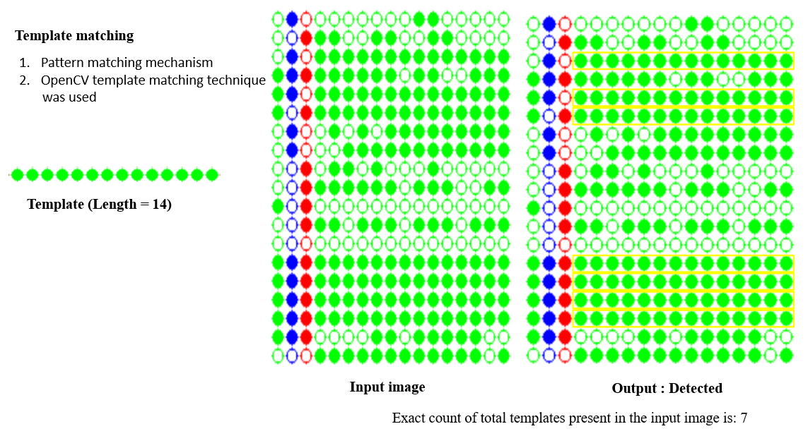

# Identifying RdDM strength based on the methylation pattern.

## Introduction

Template Matching is a high-level machine vision technique that identifies the parts on an image that match a predefined template. Advanced template matching algorithms allow to find occurrences of the template regardless of their orientation and local brightness.

Template Matching techniques are flexible and relatively straightforward to use, which makes them one of the most popular methods of object localization. Their applicability is limited mostly by the available computational power, as identification of big and complex templates can be time-consuming.

Template Matching techniques are expected to address the following need: provided a reference image of an object (the template image) and an image to be inspected (the input image) we want to identify all input image locations at which the object from the template image is present. Depending on the specific problem at hand, we may (or may not) want to identify the rotated or scaled occurrences.

Template Matching method, although which is insufficient for real-life applications illustrates the core concept from which the actual Template Matching algorithms stem from. This method can be  enhanced and extended in advanced Grayscale-based Matching and Edge-based Matching routines.

**RNA directed DNA methylation (RdDM). A stretch of methylation signifies strong RdDM, whereas intermittent methylation 
suggest inefficient maintenance of methylation and not RdDM. Here, we were trying to differentiate long stretches from short stretches**

* Types of methylation

  CG - Cytosine is immediately follwed any a Guanine
  
  CHG - Cytosine followed by any nucleotide, expect Gaunine and immediately followed by A Guanine
  
  CHH - No Gaunine around Cytosine nucleotide
  

* Types of methylation pattern analysis

  
   
   

    <em>CHH analysis and CNN analysis</em>

## CHH analysis
In this analysis, we are considering only Green dots and the program will count the length of a stretch and how many number of that particular stretche is available in the entire image.

## CNN analysis
CNN analysis is also termed as a whole methylation. In this analysis, we are considering the whole methylation i.e., irrespective of CG and CHG methylation. So, the program initially convert the entire image to an image with only Green dots (CG and CHG to Green dots). In the CNN analysis, we will get the larget possible stretch in the each row.

## Methodology

In this analysis, OpenCV library was used to detect the stretches from the dot plots. Template matching strategy from the OpenCV was used.
The Template matching is a technique, by which a patch or template can be matched from an actual image. This is basically a pattern matching mechanism.
In Python there is OpenCV module. Using OpenCV, we can easily find the match. So, in this problem, the OpenCV template matching techniques are used.
For template matching task, there is an accuracy factor, this factor is known as threshold. As an example, we can say that we can easily create face recognizing scheme using this template matching solution. We can provide some images of eyes or any other parts of faces, then using those images as template, it can easily find the match, but there are different variations in eyes. So, if we set the accuracy level to 50%, it will detect better than accuracy level 100%.Generally, the accuracy level is 80% in different cases.

Steps to match Templates

•	Take the actual image and convert it into a gray scale image.

•	Take template as gray scale image.

•	The template slides over the actual image and find the location where accuracy level matches.

•	When result is greater than the accuracy level, mark that position as detected.

  
  

## Software requirement

1.Windows or Mac OS

2.Python 3.7  (any python version higher than this is better)

3.Anaconda3-2020

4.Jupyter Notebook

If you install anaconda software, all other requirements will be satisfied. You do not need to install jupyter notebook or python separately

- Install python(if required): https://www.youtube.com/watch?v=4Rx_JRkwAjY

- Anaconda installation tutorial (Windows): https://www.youtube.com/watch?v=5mDYijMfSzs

- Anaconda installation tutorial (Mac OS):https://understandingdata.com/how-to-install-anaconda-mac-os/

- Jupyter notebook tutorial: https://www.youtube.com/watch?v=3C9E2yPBw7s

### Installing python libraries

After installing anaconda and setting up your jupyter notebook. You must install OpenCV latest version for the program to run.

Step1. Open your jupyter notebook in any directory in your local machine.

Step2. Type: pip install OpenCV-python and execute that cell.

Step3. Check your installation by typing import cv2.

## Running program

Steps to run the program

1.Load the input or source image.

2.Determine the total rows (rough count by just looking at the image).

3.Set the row number in the program.

4.Get each row from the input image and save them to Targets folder.

5.Make sure that you are getting full length row and total rows from the input image.

6.Make sure you are having appropriate template images in the folder Templates.

7.Once you are confident in getting all the rows, run the program and get the final counts.

